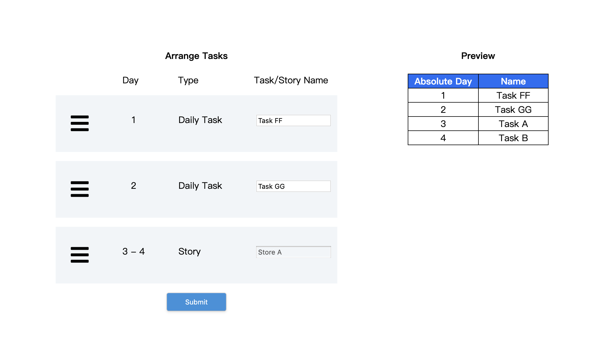

## PHP-test-v2-Cavaon
[](https://travis-ci.org/dustinhsiao21/PHP-test-v2-Cavaon)




### install

##### version
PHP: 7.2
Laravel: 5.8

##### script

```
cp .env.example .env //remember to setup database config
composer install
php artisan key:generate
php artisan migrate
php artisan db:seed
npm install
npm run dev
php artisan serve
```

### test
```
./vendor/bin/phpunit
```
